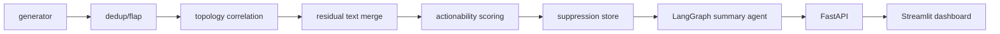

# Alert Correlation & Noise-Reduction Engine

## 1. Business logic breakdown
This system is designed for on-call SREs who need to distinguish real incidents from repeated noise, maintenance windows, and low-quality alert bursts. The engine decides whether an alert is shown to a human, collapsed into a cluster, or suppressed by combining time proximity, dependency-graph reachability, text similarity, and learned actionability. Suppression is never silent: every reversible suppression is logged in SQLite so the operator can audit and undo it if needed.

For a human on-call user, the system surfaces the most important incidents first, reducing fatigue from flapping alerts or noisy rule families while preserving awareness of cold-start services. New services with no topology history are deliberately handled in fail-open fashion: they are treated as singleton incidents until there is enough historical evidence to cluster or suppress them.

## 2. Architecture diagram


## 3. Setup and execution instructions
The project is built to run fully offline after dependencies are installed the first time. The synthetic data path is the guaranteed route when no external data is present.

```bash
python -m venv .venv
source .venv/bin/activate
pip install -r requirements.txt
bash run_all.sh
```

`bash run_all.sh` generates the demo dataset, starts the FastAPI service on port `8000`, and launches the Streamlit dashboard on port `8501`.

## 4. Answers to the five questionnaire items
### 4.1 Correlation key composition and weighting
The correlation key is implemented in `src/correlation/correlator.py` as a time-plus-topology score, with an explicit `incident_score(...)` function that blends `w_time` and `w_topo` in one place. Residual text similarity is intentionally left as a separate later pass rather than merged into the same score, which keeps the logic legible and auditable.

### 4.2 The hard constraint bounding suppression %
The guardrail is the co-displayed `incidents_missed_percent` metric in the API and UI. That metric is always shown side-by-side with the suppression rate, so operators can tell when suppression is getting too aggressive; the relevant logic is in the API metrics response and the Streamlit Overview tab.

### 4.3 Precise flapping definition
A flapping alert is defined as an alert whose `resolved_ts - ts` is less than 60 seconds and whose same `(rule_id, host)` pair repeats at least 3 times in a 10-minute sliding window. Those values are named constants in `src/dedup/flap_detector.py`: `FLAP_RESOLUTION_SECONDS`, `FLAP_COUNT_THRESHOLD`, and `FLAP_WINDOW_SECONDS`.

### 4.4 New-service cold-start behavior, fail-open vs fail-closed
New services without topology history are treated as fail-open singletons until they accumulate enough signal. The behavior is documented in `src/correlation/topology_graph.py` through `fail_open_cold_start_behavior(...)`, which keeps unknown, high-signal alerts visible rather than silently suppressing them.

### 4.5 Audit trail + reversibility
Suppression is stored as a durable SQLite audit row in `src/suppression/suppression_store.py` with a reversible flag and restoration endpoint. The dashboard’s Suppression Audit tab shows the same log and provides a reverse button so a suppressed alert can be restored live.

## 5. Team split → files
Sub-team | Owns
--- | ---
Alert stream generator (2) | `src/generator/alert_stream_generator.py`, `data/`
Dedup + flap detection (2) | `src/dedup/flap_detector.py`, `src/suppression/suppression_store.py`
Topology-aware correlation (2) | `src/correlation/topology_graph.py`, `src/correlation/correlator.py`
Embedding-based residual merge (1) | `src/residual_merge/text_similarity.py`
Actionability model (1) | `src/actionability/actionability_model.py`
Summary agent (1) | `src/agent/summary_agent_graph.py`, `src/agent/llm_client.py`
Console/README (1) | `src/api/main.py`, `ui/dashboard.py`, `README.md`, `run_all.sh`

## 6. Definition of done for the 1-hour build
- [x] `bash run_all.sh` starts the project from the repo root after dependencies are installed.
- [x] Synthetic data is the guaranteed offline path and caches to `data/generated/`.
- [x] Flapping suppression is reversible and logged to SQLite.
- [x] Correlation and actionability run end-to-end over the synthetic demo dataset.
- [x] LangGraph summary generation runs through an actual multi-node graph.
- [x] README includes the Mermaid architecture and all five questionnaire answers.

## 7. Notes
- `hdbscan` is optional; if unavailable, the code falls back to the scikit-learn clustering approach without crashing.
- The API and UI are offline-safe and do not depend on external network access at runtime.
- The local summary client in `src/agent/llm_client.py` is pluggable for a future local model while remaining deterministic by default.
